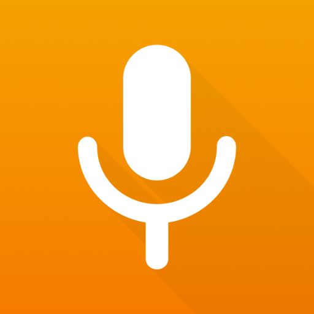
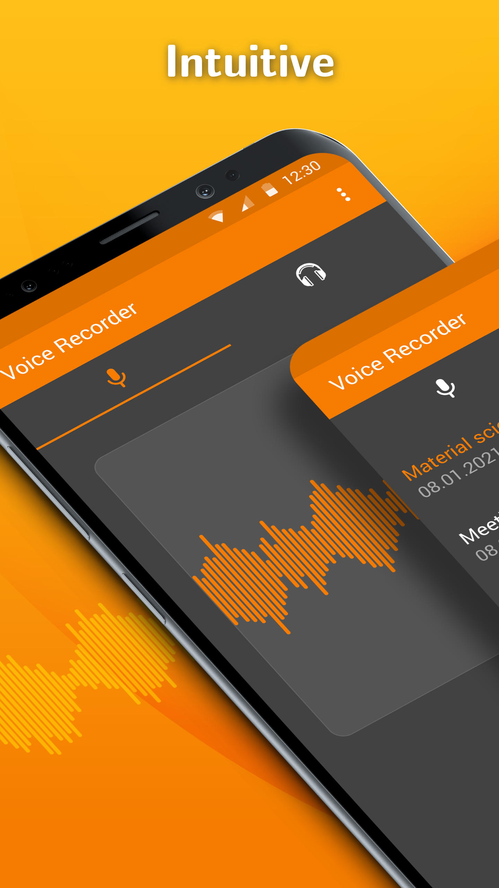
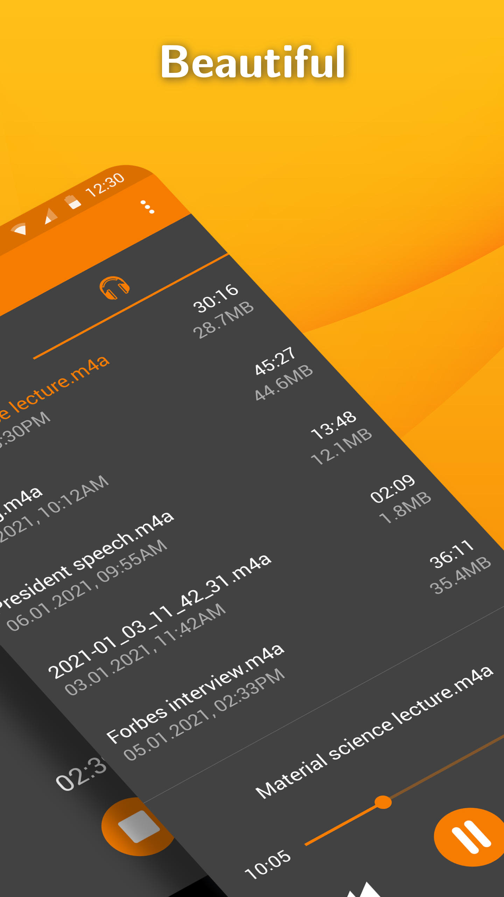
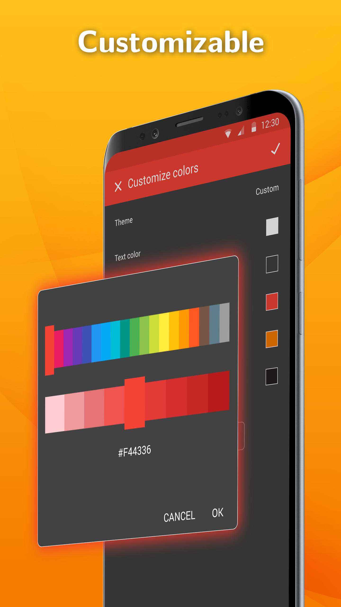

# Simple Voice Recorder

Ever wished you remember what the other person said? Or the task they gave you at a meeting? Wish no more. With this simple recorder you can record any audio really quickly.

The app goes straight to the point, it contains no fancy features that you won\'t use. Just you and the voice recorder. It shows the current sound volume on a nice visualization that you can have a lot of fun with. Provides a really intuitive and clean user interface, not much can go wrong there.

Contains no ads or unnecessary permissions. It is fully opensource, provides customizable colors.

This app is just one piece of a bigger series of apps. You can find the rest of them at https://www.simplemobiletools.com

