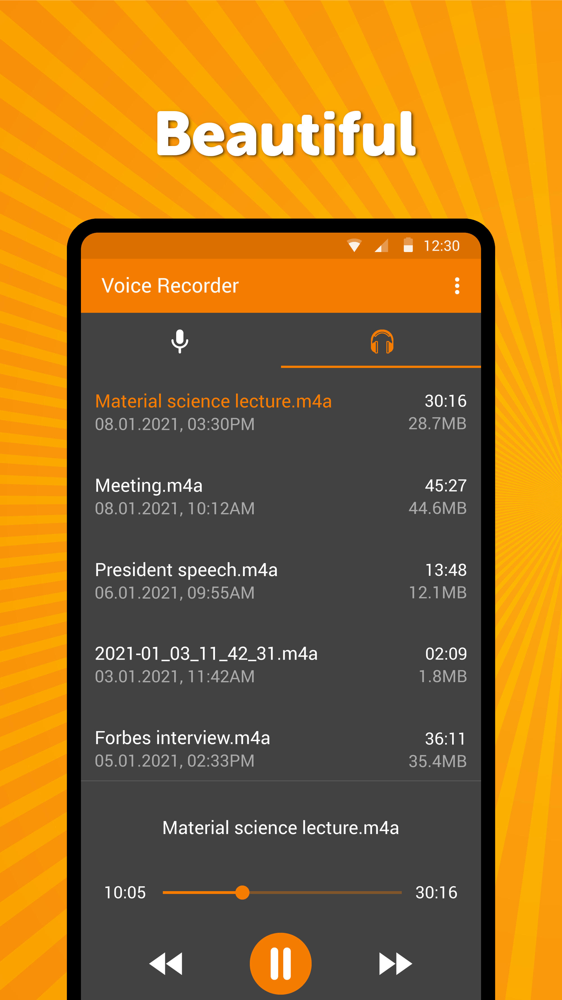
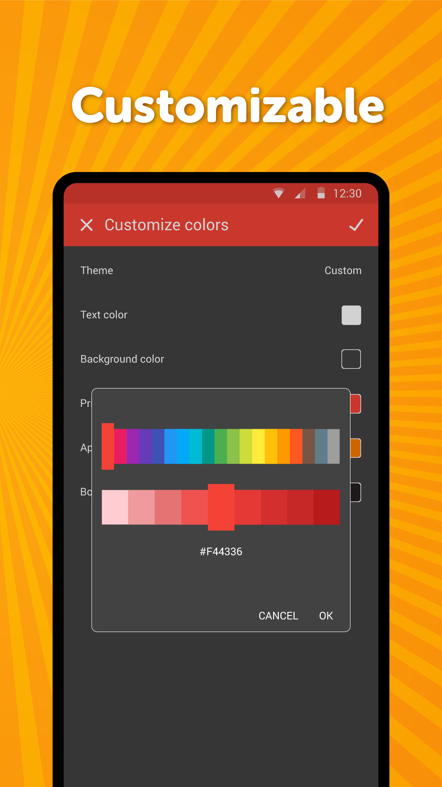

# Simple Voice Recorder

Remember what the other person said and what task you were given after a meeting.

The simple recorder is easily accessible with no fancy features, ads or unneeded permissions.

The current sound volume and a nice visualization is shown in a clean interface.

A helpful player lets you listen to your recordings quickly, rename, or delete them.

It comes with material design and dark theme by default, provides great user experience for easy usage. The lack of internet access gives you more privacy, security and stability than other apps.

Contains no ads or unnecessary permissions. It is fully opensource, provides customizable colors.

Check out the full suite of Simple Tools here:  
https://www.simplemobiletools.com

Facebook:  
https://www.facebook.com/simplemobiletools

Reddit:  
https://www.reddit.com/r/SimpleMobileTools

